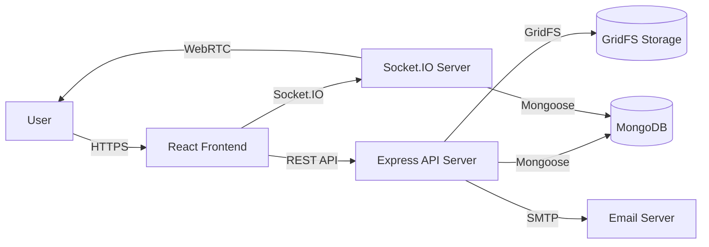
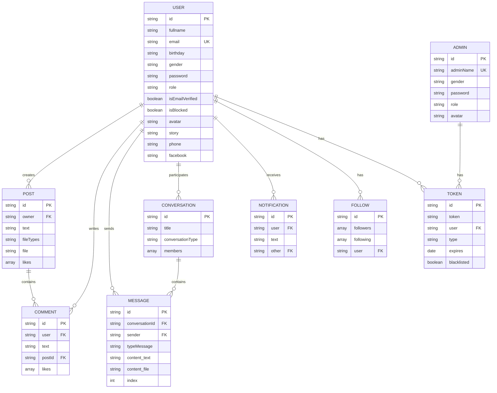

# VN-Social Network (social-media)

> A full-featured social media platform with real-time chat, video calling, and an admin panel, built with React, Express.js, and MongoDB.

---

## Overview

VN-Social Network is a full-featured social media platform built as a graduation thesis project at Ho Chi Minh City University of Technology and Education (HCMUTE). The app includes posts, comments, likes, real-time chat, video calling, notifications, and an admin panel.

---

## Features

### User Features
- Authentication (register, login, email verification, password reset, JWT sessions)
- Posts (text, image, audio, video, file attachments)
- Comments and likes on posts and comments
- Real-time chat (private and group conversations with text, media, reactions, message recall)
- Video/audio calling (WebRTC with signaling through Socket.IO)
- Follow/unfollow system
- Notifications
- User profiles (avatar, profile info, password change)
- File sharing (up to 500 MB)
- NSFW filtering (client-side nsfwjs + TensorFlow.js, server-side bad-words)

### Admin Features
- Admin panel with separate login
- User management (block/unblock users, delete posts)
- Admin creation
- Role-based access (user, admin, superadmin)

---

## Tech Stack

### Frontend
- **Framework:** React 17 (Create React App 4.0.3)
- **Language:** JavaScript (partial TypeScript)
- **UI Library:** MUI (Material UI) 5, Tailwind CSS, styled-components
- **State Management:** Redux 4.1, redux-thunk, redux-persist
- **Routing:** react-router-dom 5.3
- **HTTP Client:** axios 0.21
- **Real-time:** socket.io-client 4.3
- **NSFW Detection:** @tensorflow/tfjs 3.12, nsfwjs 2.4
- **Build Tool:** CRACO 6.3

### Backend
- **Framework:** Express 4.17
- **Language:** Node.js 12+
- **Database:** MongoDB 4.1 (Mongoose 5.13)
- **Authentication:** Passport + passport-jwt, jsonwebtoken, bcryptjs
- **File Storage:** Multer + multer-gridfs-storage (GridFS)
- **Image Processing:** sharp 0.29
- **Real-time:** Socket.IO 4.3
- **API Docs:** swagger-jsdoc + swagger-ui-express
- **Validation:** Joi 17, joi-phone-number
- **Security:** helmet, cors, express-rate-limit
- **Logging:** winston 3.2, morgan
- **Process Manager:** PM2 5.1
- **Content Filter:** bad-words 3.0

### Database
- **Database:** MongoDB (multiple databases for different file types)

### Infrastructure
- **Process Manager:** PM2
- **Deployment:** Surge.sh, Azure Container Instances

---

## Architecture



The application uses a separate Socket.IO server for real-time communication, sharing the same MongoDB database as the main API server.

---

## Request Flow

### Authentication Flow

```text
User
  ↓
POST /v1/auth/login
  ↓
AuthController
  ↓
AuthService.login()
  ↓
UserModel.findOne()
  ↓
MongoDB
  ↓
bcrypt.compare()
  ↓
Generate JWT access token (30 min)
  ↓
Generate refresh token (30 days)
  ↓
Client
```

### Post Creation Flow

```text
User
  ↓
POST /v1/post/create-post-file
  ↓
AuthMiddleware (JWT verification)
  ↓
FileMiddleware (Multer + GridFS upload)
  ↓
PostController.createPost()
  ↓
PostService.createPost()
  ↓
PostModel.save()
  ↓
MongoDB
  ↓
Return post to client
```

---

## Backend Architecture

The backend follows a layered architecture:

```text
Routes
    ↓
Middlewares (Auth, Validate, Error, Rate Limiter)
    ↓
Controllers
    ↓
Services
    ↓
Models (Mongoose)
    ↓
Database (MongoDB)
```

### Main API Server (`source_BE`)
- **Controllers:** auth, user, post, comment, conversation, message, notification, follow, image, file, profile, find, admin
- **Models:** User, Post, Comment, Conversation, Message, Notification, Follow, Group, Image, Token, Admin
- **Middlewares:** auth (JWT + RBAC), validate (Joi), error, rateLimiter, fileMiddleware (Multer + GridFS)
- **Routes:** All endpoints prefixed with `/v1`

### Socket Server (`source_BE_socket`)
- Handles all real-time events (chat, calls, typing indicators)
- JWT authentication via `wrapMiddlewareForSocketIo`
- Shares the same MongoDB database as the main API server

---

## Database Design



---

## API

All endpoints are prefixed with `/v1`. Swagger docs available at `/v1/docs` in development mode.

### Authentication (`/v1/auth`)

| Method | Endpoint | Description |
|--------|----------|-------------|
| POST | `/register` | Register new user |
| POST | `/login` | User login |
| POST | `/logout` | Logout (invalidate refresh token) |
| POST | `/refresh-tokens` | Refresh access token |
| POST | `/forgot-password` | Send password reset email |
| POST | `/reset-password` | Reset password with token |
| POST | `/send-verification-email` | Send email verification |
| POST | `/verify-email` | Verify email with token |
| POST | `/check-token` | Check token validity |
| POST | `/check-auth-v` | Check token + email verified |

### Admin Auth (`/v1/auth/admin`)

| Method | Endpoint | Description |
|--------|----------|-------------|
| POST | `/login` | Admin login |
| PUT | `/change-password` | Admin change password |

### Users (`/v1/users`)

| Method | Endpoint | Description |
|--------|----------|-------------|
| POST | `/` | Create user (admin only) |
| GET | `/` | Get all users (search, paginate) |
| GET | `/:userId` | Get user by ID |
| PATCH | `/:userId` | Update user |
| DELETE | `/:userId` | Delete user |

### Profile (`/v1/profile`)

| Method | Endpoint | Description |
|--------|----------|-------------|
| PUT | `/changeAvatar` | Upload new avatar |
| PUT | `/change-profile` | Update profile info |
| GET | `/:id` | Get profile by ID |
| PUT | `/change-password` | Change password |
| GET | `/get-summary/:id` | Get profile summary |

### Posts (`/v1/post`)

| Method | Endpoint | Description |
|--------|----------|-------------|
| POST | `/create-post-file` | Create post with file |
| POST | `/create-post-text` | Create text-only post |
| PUT | `/like` | Like/unlike post |
| POST | `/like` | Check if post is liked |
| PUT | `/comment` | Comment on post |
| GET | `/` | Get all posts (paginated) |
| GET | `/get-my-post` | Get own posts |
| DELETE | `/` | Delete post |
| PUT | `/` | Edit post text |

### Comments (`/v1/comment`)

| Method | Endpoint | Description |
|--------|----------|-------------|
| PUT | `/like` | Like/unlike comment |
| GET | `/` | Get comments |

### Conversations (`/v1/conversation`)

| Method | Endpoint | Description |
|--------|----------|-------------|
| GET | `/` | Get user's conversations |
| POST | `/private` | Get/create private conversation |
| POST | `/create-group` | Create group conversation |
| PUT | `/add-member` | Add member to group |
| PUT | `/out-group` | Leave group |

### Messages (`/v1/message`)

| Method | Endpoint | Description |
|--------|----------|-------------|
| POST | `/` | Send text message |
| POST | `/like/:conversationId` | Send like reaction |
| POST | `/love/:conversationId` | Send love reaction |
| POST | `/media` | Send media message |
| GET | `/:conversationId` | Get messages from conversation |
| PUT | `/` | Recall (unsend) message |

### Notifications (`/v1/notification`)

| Method | Endpoint | Description |
|--------|----------|-------------|
| GET | `/` | Get notifications |
| DELETE | `/` | Delete notification |

### Follow (`/v1/follow`)

| Method | Endpoint | Description |
|--------|----------|-------------|
| PUT | `/` | Follow/unfollow user |
| GET | `/:id` | Find followers/following |

### Files & Images (`/v1/file`, `/v1/image`)

| Method | Endpoint | Description |
|--------|----------|-------------|
| GET | `/v1/file/:id` | Get file by ID |
| GET | `/v1/image/:id` | Get image by ID |
| DELETE | `/v1/image/:id` | Delete image |

### Admin (`/v1/admin`)

| Method | Endpoint | Description |
|--------|----------|-------------|
| POST | `/createAdmin` | Create new admin |
| PUT | `/blockUser/:userId` | Block/unblock user |
| DELETE | `/post` | Delete any post |

---

## Authentication & Authorization

```text
User
  ↓
POST /v1/auth/login
  ↓
AuthController
  ↓
AuthService.login()
  ↓
UserModel.findOne()
  ↓
MongoDB
  ↓
bcrypt.compare()
  ↓
Generate JWT access token (30 min)
  ↓
Generate refresh token (30 days)
  ↓
Client
```

- **Access Tokens:** JWT, 30-minute expiry
- **Refresh Tokens:** 30-day expiry, stored in database with blacklisting
- **Role-Based Access Control:** Three roles — `user`, `admin`, `superadmin`
- **Permissions:** `getUsers`, `manageUsers`, `getAdmins`, `manageAdmins`
- **Blocked User Check:** Blocked users are rejected at auth middleware level
- **Rate Limiting:** 15 requests per 15 minutes on auth endpoints (production only)
- **Socket Auth:** JWT-based, wrapped via `wrapMiddlewareForSocketIo`

---

## Important Technical Decisions

### Why Separate Socket.IO Server?

**Problem:** Real-time communication requires persistent WebSocket connections, which can interfere with the main API server's request-response cycle.

**Decision:** Deploy a separate Socket.IO server that shares the same MongoDB database.

**Reason:** Isolates real-time traffic from REST API traffic, allowing independent scaling and preventing WebSocket connections from consuming API server resources.

**Trade-off:** Adds operational complexity with an additional service to deploy and monitor.

### Why GridFS for File Storage?

**Problem:** Social media applications need to store large files (images, videos, audio) that exceed MongoDB's 16MB document size limit.

**Decision:** Use GridFS with separate MongoDB databases for each file type (image, audio, video, file).

**Reason:** GridFS automatically splits large files into chunks, handles metadata separately, and allows streaming downloads. Separate databases prevent one file type from affecting others.

**Trade-off:** More complex queries compared to storing file references in a single collection.

### Why Passport JWT Strategy?

**Problem:** Both REST API and Socket.IO need consistent authentication.

**Decision:** Use Passport with JWT strategy for both servers.

**Reason:** Passport provides a modular authentication middleware that works seamlessly with Express and can be wrapped for Socket.IO using `wrapMiddlewareForSocketIo`.

**Trade-off:** JWT tokens cannot be invalidated before expiry without additional blacklisting logic.

### Why Client-Side NSFW Detection?

**Problem:** Server-side NSFW detection requires significant computational resources and may not scale well.

**Decision:** Use `nsfwjs` + `@tensorflow/tfjs` for client-side NSFW detection, supplemented by server-side `bad-words` filtering.

**Reason:** Offloads image classification to the client, reducing server load. Server-side text filtering provides a baseline content moderation layer.

**Trade-off:** Client-side detection can be bypassed by malicious users.

---

## Error Handling & Validation

- **Request Validation:** Joi schemas for all endpoints
- **Error Handling:** Custom `ApiError` class with `catchAsync` wrapper
- **Error Middleware:** Centralized error converter and handler
- **HTTP Status Codes:** Standard codes with descriptive messages
- **Rate Limiting:** `express-rate-limit` on auth endpoints

---

## Testing

- **Unit Tests:** Jest 26, supertest, node-mocks-http
- **Test Framework:** Jest with supertest for API testing

```bash
cd source_Back-end/source_BE
npm test
```

---

## Docker / Local Development

### Prerequisites
- Node.js 12+
- MongoDB 4.1+ (multiple databases for different file types)
- SMTP server (for email verification and password reset)

### Setup

```bash
git clone https://github.com/longdrache/social-media.git
cd social-media

# Configure environment
cp source_Back-end/source_BE/.env.example source_Back-end/source_BE/.env
cp source_Back-end/source_BE_SOCKET/.env.example source_Back-end/source_BE_SOCKET/.env

# Install dependencies
cd source_Back-end/source_BE
npm install

cd ../source_BE_socket
npm install

cd ../../source_Front-end
npm install
```

### Running the Applications

**Backend (Main API):**
```bash
cd source_Back-end/source_BE
npm run dev
```

**Backend (Socket Server):**
```bash
cd source_Back-end/source_BE_socket
npm run dev
```

**Frontend:**
```bash
cd source_Front-end
npm start
```

The apps will be available at:
- **Frontend:** http://localhost:3000
- **Backend API:** http://localhost:3000 (configured via `PORT`)
- **Socket Server:** http://localhost:3001 (configured via `PORT`)

---

## Environment Variables

### Main API Server (`source_Back-end/source_BE/.env`)

| Variable | Description | Default |
|----------|-------------|---------|
| `PORT` | API server port | 3000 |
| `MONGODB_URL` | Main MongoDB URL | `mongodb://127.0.0.1:27017/node-boilerplate` |
| `MONGODB_URL_TEST` | Test database URL | (required) |
| `MONGODB_URL_IMAGE` | Image GridFS database URL | (required) |
| `MONGODB_URL_AUDIO` | Audio GridFS database URL | (required) |
| `MONGODB_URL_VIDEO` | Video GridFS database URL | (required) |
| `MONGODB_URL_FILE` | File GridFS database URL | (required) |
| `JWT_SECRET` | JWT signing secret | `thisisasamplesecret` |
| `JWT_ACCESS_EXPIRATION_MINUTES` | Access token TTL | 30 |
| `JWT_REFRESH_EXPIRATION_DAYS` | Refresh token TTL | 30 |
| `JWT_RESET_PASSWORD_EXPIRATION_MINUTES` | Reset password token TTL | 10 |
| `JWT_VERIFY_EMAIL_EXPIRATION_MINUTES` | Verify email token TTL | 10 |
| `SMTP_HOST` | Email server host | `email-server` |
| `SMTP_PORT` | Email server port | 587 |
| `SMTP_USERNAME` | Email username | — |
| `SMTP_PASSWORD` | Email password | — |
| `EMAIL_FROM` | From address | `support@yourapp.com` |

---

## Project Structure

```
social-media/
├── README.md
├── source_Back-end/
│   ├── source_BE/                     # Main REST API server
│   │   ├── .env.example
│   │   ├── package.json
│   │   └── src/
│   │       ├── index.js               # Entry point
│   │       ├── app.js                 # Express app setup
│   │       ├── config/                # Configuration (env, passport, upload, etc.)
│   │       ├── models/                # Mongoose models
│   │       ├── controllers/           # Route controllers
│   │       ├── routes/v1/             # API routes (all under /v1)
│   │       ├── middlewares/           # Auth, validation, error handling
│   │       ├── services/              # Business logic
│   │       ├── validations/           # Joi validation schemas
│   │       ├── utils/                 # Utilities (ApiError, catchAsync, etc.)
│   │       └── docs/                  # Swagger YAML definitions
│   │
│   └── source_BE_socket/              # Socket.IO server
│       ├── package.json
│       └── src/
│           ├── index.js               # Entry point
│           ├── app.js                 # Express app
│           ├── socket/index.js         # Socket.IO event handlers
│           ├── config/                # Configuration
│           ├── models/                # Mongoose models (subset)
│           └── middlewares/           # Auth middleware
│
└── source_Front-end/                  # React frontend
    ├── package.json
    └── src/
        ├── index.js                   # React entry point
        ├── App.js                     # Root component
        ├── routes/                    # Route definitions & guards
        ├── store/                     # Redux store
        ├── reducers/                  # Redux reducers
        ├── axiosApi/                  # API modules
        ├── containers/                # Page-level components
        ├── components/                # Reusable UI components
        ├── components-Admin/          # Admin panel components
        ├── layout/                    # Layout wrappers
        ├── skeletons/                 # Loading skeletons
        └── css/                       # Stylesheets
```

---

## Deployment

- **Frontend:** Surge.sh (`vn-smxh.surge.sh`) and Azure Container Instances
- **Backend:** Azure Container Instances
- **Process Manager:** PM2

---

## CI/CD

No CI/CD pipeline is configured in the repository.

---

## Challenges & Solutions

### Challenge: Real-Time Video Calling

**Problem:** Implementing video/audio calling requires signaling for WebRTC peer connection establishment.

**Solution:** Used Socket.IO for WebRTC signaling (offer, answer, ICE candidate exchange) with room-based call management. Media streams flow directly between peers via WebRTC.

**Trade-off:** Requires STUN/TURN servers for NAT traversal in production environments.

### Challenge: Large File Storage

**Problem:** Social media applications need to store large files (videos up to 500MB) that exceed MongoDB's 16MB document limit.

**Solution:** Used GridFS with separate MongoDB databases for each file type (image, audio, video, file). Files are automatically chunked and can be streamed.

**Trade-off:** More complex queries compared to storing file references in a single collection.

### Challenge: Content Moderation

**Problem:** User-generated content may include inappropriate images or profanity.

**Solution:** Implemented a two-layer approach: client-side NSFW detection using `nsfwjs` + `@tensorflow/tfjs` for images, and server-side `bad-words` filtering for text.

**Trade-off:** Client-side detection can be bypassed; server-side image detection would require significant computational resources.

---

## What I Learned

- Building a full-stack social media platform with React, Express.js, and MongoDB
- Implementing real-time features with Socket.IO (chat, typing indicators, online status)
- Integrating WebRTC for video/audio calling with Socket.IO signaling
- Designing a MongoDB schema with GridFS for large file storage
- Implementing JWT-based authentication with Passport and role-based access control
- Building an admin panel with user management and content moderation
- Using Redux for state management in a complex React application
- Implementing client-side NSFW detection with TensorFlow.js

---

## Future Improvements

- Add end-to-end encryption for private messages
- Implement message read receipts
- Add push notifications for mobile devices
- Improve NSFW detection with server-side image classification
- Add more comprehensive automated tests
- Implement message search functionality
- Add user blocking and reporting features

---

## Demo

- **Frontend:** [https://vn-smxh.surge.sh/](https://vn-smxh.surge.sh/)
- **API Docs:** Available at `/v1/docs` in development mode

---

## Resume Summary

- Built a full-stack social media platform using React, Express.js, and MongoDB with real-time chat and video calling
- Implemented JWT-based authentication with Passport, role-based access control, and refresh token blacklisting
- Designed a MongoDB schema with 11 models and GridFS for large file storage (images, audio, video up to 500MB)
- Built a separate Socket.IO server for real-time communication (chat, typing indicators, WebRTC signaling)
- Integrated WebRTC for peer-to-peer video/audio calling with Socket.IO signaling
- Implemented client-side NSFW detection using TensorFlow.js and server-side content filtering
- Built an admin panel with user management, post moderation, and role-based access control
- Deployed the application to Azure Container Instances with PM2 process management
